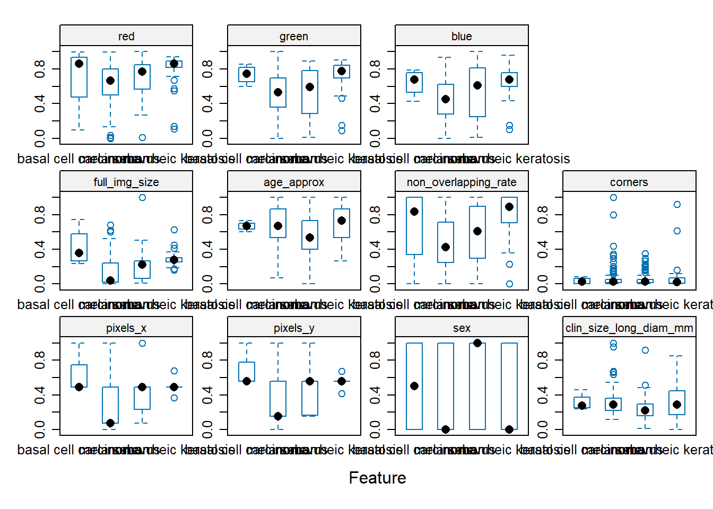

```r
knitr::opts_chunk$set(warning = FALSE)
```

```r
# Set the CRAN mirror
options(repos = c(CRAN = "https://cran.r-project.org"))

# Install the packages
install.packages("caret")
```

```
## Installing package into 'C:/Users/abdul/AppData/Local/R/win-library/4.3'
## (as 'lib' is unspecified)
```

```
## package 'caret' successfully unpacked and MD5 sums checked
## 
## The downloaded binary packages are in
## 	C:\Users\abdul\AppData\Local\Temp\RtmpU9ZDYG\downloaded_packages
```

```r
install.packages("skimr")
```

```
## Installing package into 'C:/Users/abdul/AppData/Local/R/win-library/4.3'
## (as 'lib' is unspecified)
```

```
## package 'skimr' successfully unpacked and MD5 sums checked
## 
## The downloaded binary packages are in
## 	C:\Users\abdul\AppData\Local\Temp\RtmpU9ZDYG\downloaded_packages
```

```r
install.packages("klaR")
```

```
## Installing package into 'C:/Users/abdul/AppData/Local/R/win-library/4.3'
## (as 'lib' is unspecified)
```

```
## package 'klaR' successfully unpacked and MD5 sums checked
## 
## The downloaded binary packages are in
## 	C:\Users\abdul\AppData\Local\Temp\RtmpU9ZDYG\downloaded_packages
```

```r
# Load the libraries
library(caret)
```

```
## Zorunlu paket yükleniyor: ggplot2
```

```
## Zorunlu paket yükleniyor: lattice
```

```r
library(skimr)
library(RANN)
library(class)
library(dplyr)
```

```
## 
## Attaching package: 'dplyr'
```

```
## The following objects are masked from 'package:stats':
## 
##     filter, lag
```

```
## The following objects are masked from 'package:base':
## 
##     intersect, setdiff, setequal, union
```

```r
library(randomForest)
```

```
## randomForest 4.7-1.1
```

```
## Type rfNews() to see new features/changes/bug fixes.
```

```
## 
## Attaching package: 'randomForest'
```

```
## The following object is masked from 'package:dplyr':
## 
##     combine
```

```
## The following object is masked from 'package:ggplot2':
## 
##     margin
```

```r
library(klaR)
```

```
## Zorunlu paket yükleniyor: MASS
```

```
## 
## Attaching package: 'MASS'
```

```
## The following object is masked from 'package:dplyr':
## 
##     select
```
Read the data.

```r
mole <- read.csv("mole2_dataset.csv")
```

1.Split your data into train (80%) and test (20%) datasets using caret’s createDataPartition function.

```r
set.seed(100)
trainRowNumbers <- createDataPartition(mole$diagnosis, p=0.8, list=FALSE)
trainData <- mole[trainRowNumbers,]
testData <- mole[-trainRowNumbers,]
```

2 Use the skim_to_wide function in skimr package, and provide descriptive stats for each column. Comment!

```r
skimmed <- skim_to_wide(trainData)
skimmed
```


Table: Data summary

|                         |           |
|:------------------------|:----------|
|Name                     |Piped data |
|Number of rows           |321        |
|Number of columns        |14         |
|_______________________  |           |
|Column type frequency:   |           |
|character                |3          |
|numeric                  |11         |
|________________________ |           |
|Group variables          |None       |


**Variable type: character**

|skim_variable | n_missing| complete_rate| min| max| empty| n_unique| whitespace|
|:-------------|---------:|-------------:|---:|---:|-----:|--------:|----------:|
|image_id      |         0|             1|  12|  12|     0|      321|          0|
|sex           |         0|             1|   0|   6|     1|        3|          0|
|diagnosis     |         0|             1|   5|  20|     0|        4|          0|


**Variable type: numeric**

|skim_variable          | n_missing| complete_rate|      mean|        sd|       p0|      p25|       p50|       p75|       p100|hist  |
|:----------------------|---------:|-------------:|---------:|---------:|--------:|--------:|---------:|---------:|----------:|:-----|
|X                      |         0|          1.00|    196.00|    116.33|     0.00|    95.00|    194.00|    297.00|     399.00|▇▇▇▇▇ |
|pixels_x               |         0|          1.00|   2329.09|   1146.36|   640.00|  1024.00|   1872.00|   3264.00|    6000.00|▆▅▇▁▁ |
|pixels_y               |         0|          1.00|   1747.12|    776.81|   480.00|  1024.00|   1771.00|   2448.00|    4000.00|▇▁▇▁▁ |
|clin_size_long_diam_mm |       214|          0.33|      6.63|      3.97|     1.60|     3.85|      5.30|      7.75|      19.30|▇▅▂▁▁ |
|full_img_size          |         0|          1.00| 333350.45| 274629.13| 24653.00| 82868.00| 213568.00| 529537.00| 1907816.00|▇▆▁▁▁ |
|age_approx             |         1|          1.00|     58.28|     15.85|    10.00|    45.00|     60.00|     70.00|      85.00|▁▃▇▇▅ |
|non_overlapping_rate   |         0|          1.00|    112.70|     63.36|     0.00|    56.72|    120.17|    170.03|     200.00|▅▆▅▆▇ |
|corners                |         0|          1.00|    142.45|    284.13|     0.00|    32.00|     61.00|    127.00|    2280.00|▇▁▁▁▁ |
|red                    |        17|          0.95|    155.02|     51.23|     1.86|   126.54|    169.13|    196.13|     235.49|▁▂▅▇▇ |
|green                  |        17|          0.95|    109.43|     49.72|     1.86|    72.37|    116.98|    151.63|     223.03|▃▅▆▇▁ |
|blue                   |        17|          0.95|     99.40|     49.32|     1.86|    57.45|    101.87|    138.87|     213.76|▅▇▇▇▂ |

3 Predict and impute the missing values with k-Nearest Neighbors using preProcess function in caret. Comment!

```r
preProcess_missingdata_model <- preProcess(trainData, method='knnImpute')
preProcess_missingdata_model
```

```
## Created from 107 samples and 14 variables
## 
## Pre-processing:
##   - centered (11)
##   - ignored (3)
##   - 5 nearest neighbor imputation (11)
##   - scaled (11)
```
It has centered (subtract by mean) 11 variables, ignored 3, used k=5 (considered 5 nearest neighbors) to predict the missing 11 values and finally scaled (divide by standard deviation) 11 variables.

```r
trainData <- predict(preProcess_missingdata_model, newdata = trainData)
```

4. After you impute missing values, use variable transformations. Convert all the numeric variables to range between 0 and 1, by setting method=range in preProcess function.

```r
preProcess_range_model <- preProcess(trainData, method='range')
trainData <- predict(preProcess_range_model, newdata = trainData)
```

5. Use caret’s featurePlot() function to visually examine how the predictors influence the predictor variable. Comment!


```r
trainData$sex <- ifelse(trainData$sex == "male", 0, 1)
testData$sex <- ifelse(testData$sex == "male", 0, 1)
trainData$diagnosis <- as.factor(trainData$diagnosis)
featurePlot(x = trainData[, 3:13], 
            y = trainData$diagnosis, 
            plot = "box",
            strip=strip.custom(par.strip.text=list(cex=.7)),
            scales = list(x = list(relation="free"), 
                          y = list(relation="free")))
```

<!-- -->
Boxes represents in order: basel cell carcinoma - melanoma - nevus - seborrheic keratosis. The black dot in the box represents mean. The blue box shows the part where the data is dense. It also shows the data that is left out in the lines outside the box. The different the height and placement of the boxes, the more different their effects on the y variable will be. As a result, there is a visible difference in all numeric variables except the "corners" variable. Some differences are from blue box sources and some are from mean sources.

6. 
a. Use train() function to build the machine learning model. Choose knn algorithm.

```r
testData2 <- predict(preProcess_missingdata_model, testData)
testData4 <- predict(preProcess_range_model, testData2)
trainData <- trainData[, -2]
testData4 <- testData4[, -2]
set.seed(123)
knn_model <- train(
   diagnosis ~ .,
   data = trainData,
   method = "knn"
)
```
b. Make predictions for test data using the predict() function.

```r
predictKnn <- predict(knn_model, newdata = testData4)
testData4$diagnosis <- as.factor(testData4$diagnosis)
predictKnn <- as.factor(predictKnn)
levels_test <- levels(testData4$diagnosis)
levels_predict <- levels(predictKnn)
if (!identical(levels_test, levels_predict)) {
   predictKnn <- factor(predictKnn, levels = levels_test)
}
```
c. Construct the confusion matrix to compare the predictions (data) vs the actuals (reference). 

```r
matrixKnn <- confusionMatrix(predictKnn, testData4$diagnosis)
print(matrixKnn)
```

```
## Confusion Matrix and Statistics
## 
##                       Reference
## Prediction             basal cell carcinoma melanoma nevus seborrheic keratosis
##   basal cell carcinoma                    0        0     0                    0
##   melanoma                                0       26     8                    1
##   nevus                                   1        7    17                    2
##   seborrheic keratosis                    0        6     3                    8
## 
## Overall Statistics
##                                         
##                Accuracy : 0.6456        
##                  95% CI : (0.5299, 0.75)
##     No Information Rate : 0.4937        
##     P-Value [Acc > NIR] : 0.004646      
##                                         
##                   Kappa : 0.4376        
##                                         
##  Mcnemar's Test P-Value : NA            
## 
## Statistics by Class:
## 
##                      Class: basal cell carcinoma Class: melanoma Class: nevus
## Sensitivity                              0.00000          0.6667       0.6071
## Specificity                              1.00000          0.7750       0.8039
## Pos Pred Value                               NaN          0.7429       0.6296
## Neg Pred Value                           0.98734          0.7045       0.7885
## Prevalence                               0.01266          0.4937       0.3544
## Detection Rate                           0.00000          0.3291       0.2152
## Detection Prevalence                     0.00000          0.4430       0.3418
## Balanced Accuracy                        0.50000          0.7208       0.7055
##                      Class: seborrheic keratosis
## Sensitivity                               0.7273
## Specificity                               0.8676
## Pos Pred Value                            0.4706
## Neg Pred Value                            0.9516
## Prevalence                                0.1392
## Detection Rate                            0.1013
## Detection Prevalence                      0.2152
## Balanced Accuracy                         0.7975
```

7. 
a. Use train() function to build the machine learning model. Choose random forest algorithm.

```r
set.seed(123)
rf_model <- train(
   diagnosis ~ .,
   data = trainData,
   method = "rf"
)
```
b. Make predictions for test data using the predict() function.

```r
predictRf <- predict(rf_model, newdata = testData4)
testData4$diagnosis <- as.factor(testData4$diagnosis)
predictRf <- as.factor(predictRf)
levels_test <- levels(testData4$diagnosis)
levels_predict <- levels(predictRf)
if (!identical(levels_test, levels_predict)) {
   predictRf <- factor(predictRf, levels = levels_test)
}
```
c. Construct the confusion matrix to compare the predictions (data) vs the actuals (reference). 

```r
matrixRf <- confusionMatrix(predictRf, testData4$diagnosis)
print(matrixRf)
```

```
## Confusion Matrix and Statistics
## 
##                       Reference
## Prediction             basal cell carcinoma melanoma nevus seborrheic keratosis
##   basal cell carcinoma                    0        0     0                    0
##   melanoma                                1       31     8                    4
##   nevus                                   0        6    17                    1
##   seborrheic keratosis                    0        2     3                    6
## 
## Overall Statistics
##                                           
##                Accuracy : 0.6835          
##                  95% CI : (0.5692, 0.7837)
##     No Information Rate : 0.4937          
##     P-Value [Acc > NIR] : 0.0004956       
##                                           
##                   Kappa : 0.4708          
##                                           
##  Mcnemar's Test P-Value : NA              
## 
## Statistics by Class:
## 
##                      Class: basal cell carcinoma Class: melanoma Class: nevus
## Sensitivity                              0.00000          0.7949       0.6071
## Specificity                              1.00000          0.6750       0.8627
## Pos Pred Value                               NaN          0.7045       0.7083
## Neg Pred Value                           0.98734          0.7714       0.8000
## Prevalence                               0.01266          0.4937       0.3544
## Detection Rate                           0.00000          0.3924       0.2152
## Detection Prevalence                     0.00000          0.5570       0.3038
## Balanced Accuracy                        0.50000          0.7349       0.7349
##                      Class: seborrheic keratosis
## Sensitivity                              0.54545
## Specificity                              0.92647
## Pos Pred Value                           0.54545
## Neg Pred Value                           0.92647
## Prevalence                               0.13924
## Detection Rate                           0.07595
## Detection Prevalence                     0.13924
## Balanced Accuracy                        0.73596
```

7. 
a. Use train() function to build the machine learning model. Choose naïve bayes classification algorithm.

```r
set.seed(123)
nb_model <- train(
   diagnosis ~ .,
   data = trainData,
   method = "nb"
)
```
b. Make predictions for test data using the predict() function.

```r
predictNb <- predict(nb_model, newdata = testData4)
testData4$diagnosis <- as.factor(testData4$diagnosis)
predictNb <- as.factor(predictNb)
levels_test <- levels(testData4$diagnosis)
levels_predict <- levels(predictNb)
if (!identical(levels_test, levels_predict)) {
   predictNb <- factor(predictNb, levels = levels_test)
}
```
c. Construct the confusion matrix to compare the predictions (data) vs the actuals (reference). 

```r
matrixNb <- confusionMatrix(predictNb, testData4$diagnosis)
print(matrixNb)
```

```
## Confusion Matrix and Statistics
## 
##                       Reference
## Prediction             basal cell carcinoma melanoma nevus seborrheic keratosis
##   basal cell carcinoma                    0        0     0                    0
##   melanoma                                1       25    10                    0
##   nevus                                   0        4     3                    0
##   seborrheic keratosis                    0       10    15                   11
## 
## Overall Statistics
##                                           
##                Accuracy : 0.4937          
##                  95% CI : (0.3792, 0.6086)
##     No Information Rate : 0.4937          
##     P-Value [Acc > NIR] : 0.5446          
##                                           
##                   Kappa : 0.2556          
##                                           
##  Mcnemar's Test P-Value : NA              
## 
## Statistics by Class:
## 
##                      Class: basal cell carcinoma Class: melanoma Class: nevus
## Sensitivity                              0.00000          0.6410      0.10714
## Specificity                              1.00000          0.7250      0.92157
## Pos Pred Value                               NaN          0.6944      0.42857
## Neg Pred Value                           0.98734          0.6744      0.65278
## Prevalence                               0.01266          0.4937      0.35443
## Detection Rate                           0.00000          0.3165      0.03797
## Detection Prevalence                     0.00000          0.4557      0.08861
## Balanced Accuracy                        0.50000          0.6830      0.51436
##                      Class: seborrheic keratosis
## Sensitivity                               1.0000
## Specificity                               0.6324
## Pos Pred Value                            0.3056
## Neg Pred Value                            1.0000
## Prevalence                                0.1392
## Detection Rate                            0.1392
## Detection Prevalence                      0.4557
## Balanced Accuracy                         0.8162
```
